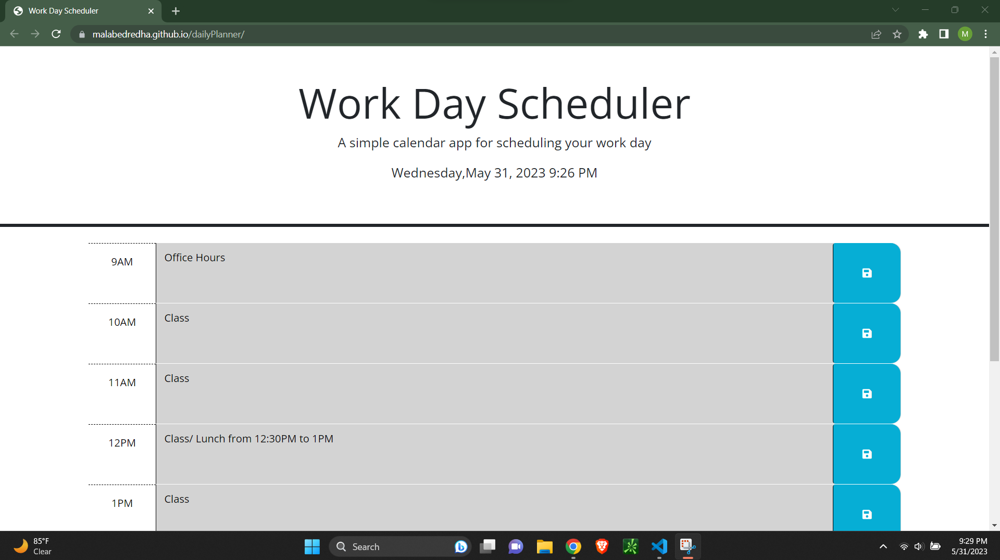

In this challenge I took preexisting code and modified it to fit the requirements of a daily planner based on a work schedule, where it color codes based on "past, present and future"

Deployed Link : https://malabedredha.github.io/dailyPlanner/

